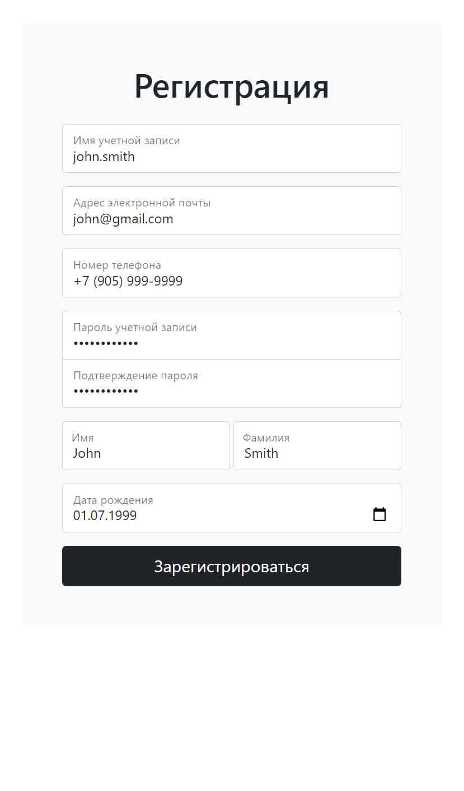
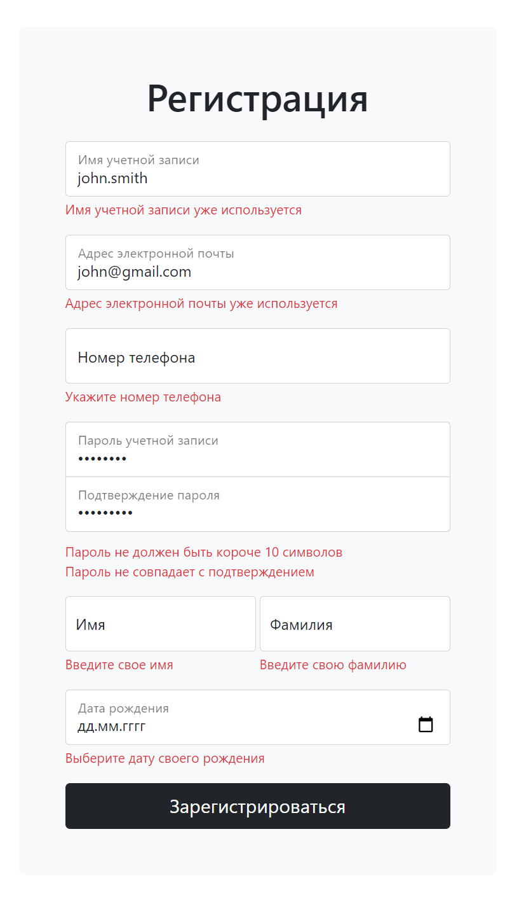

# Form Validation App
## Описание
Приложение реализует простую форму регистрации пользователя с валидацией введенной информации
## Реализованные проверки
* На заполнение всех полей
* На уникальность логина и адреса почты
* На валидность адреса почты
* На валидность номера телефона
* На длину пароля
* На совпадение пароля с подтверждением пароля
* На корректность формата даты

Все проверки выполняются на клиенте и дублируются на сервере, на случай отключенного JS в браузере
## Установка и запуск
Потребуются установленный SDK для .NET 5.0 и Git. Используются Bootstrap v5.0 и jQuery.Inputmask.

В текущем каталоге нужно вызвать команду клонирования репозитория:
```bash
git clone https://github.com/fazlyevt/form-validation-app
```
Затем перейти в папку проекта и запустить сервис
```bash
cd form-validation-app
dotnet run
```
## Демонстрация работы
Ввод данных | Валидация
---|---
|